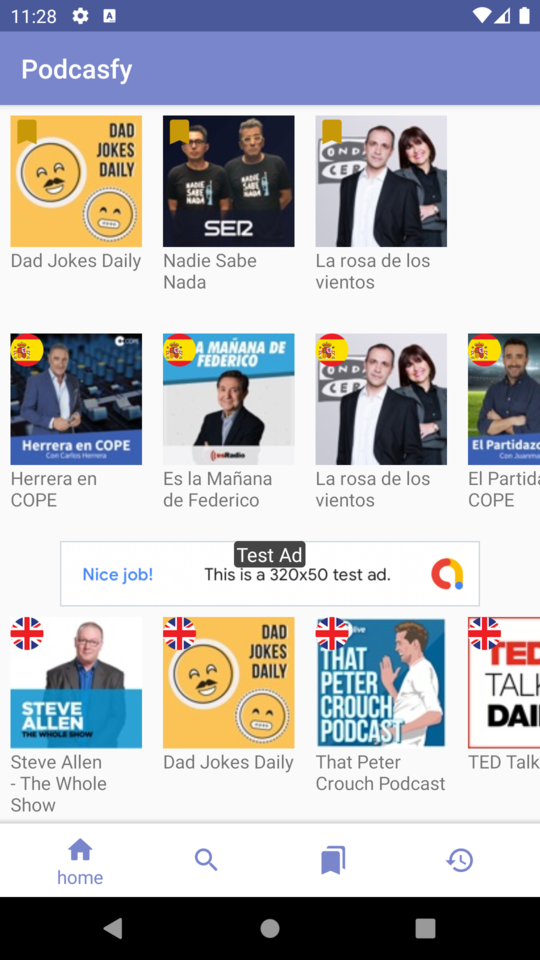
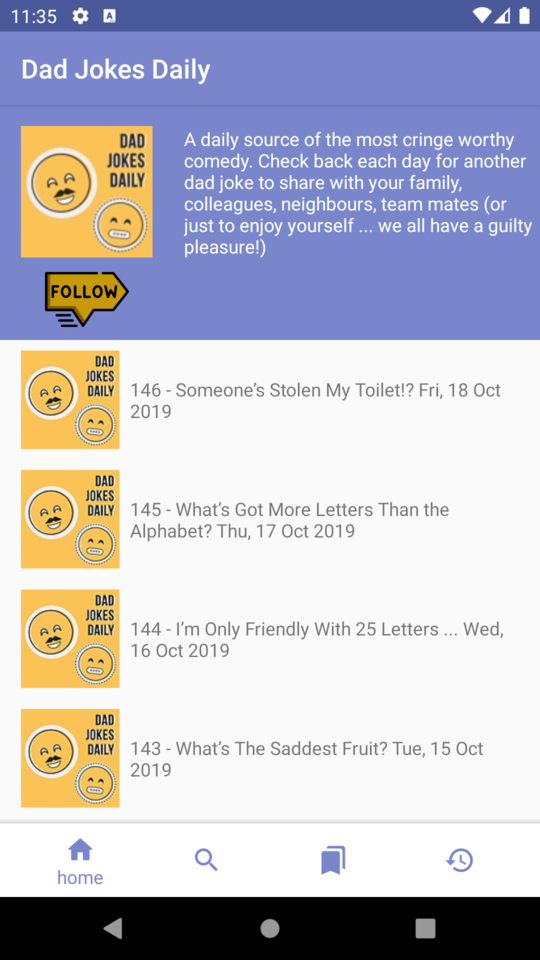
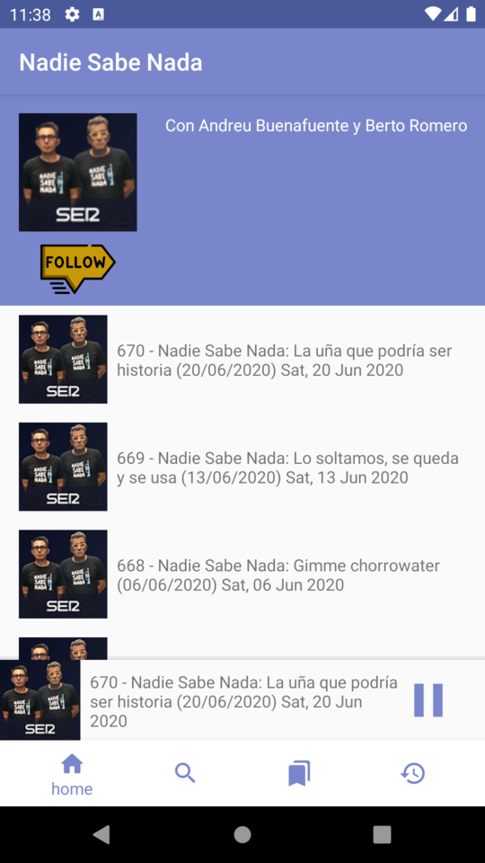
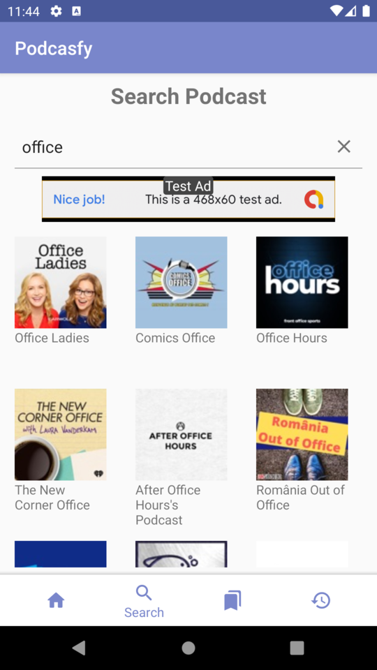

# Podcastfy 

Udacity's Android developer nanodegree final project.

## Description

Podcastfy is a podcast application for the www.radio-uk.co.uk webpage. This site has a huge varity of podcast in several languages, which makes the content available in Podcastfy almost unlimited!

With Podcastfy you will be able to:

* Listen to podcasts. Here you can slide up to see the details and have a better controll of the reproducer, or slide down to navigate the app while listeting to your podcast!. Swipe to the left to stop it!
* Subscribe/unsubscribe to your favorites to not miss a new episode.
* Search podcasts. This search is not limited by language, so you may find very insteresting podcasts!
* See the historical of episodes you already listened to. Swipe to the left if you want to remove an episode!

## Details

### Architecture

The application follows the [single Acitivty pattern](https://www.youtube.com/watch?v=2k8x8V77CrU) having only one activity and some fragments. To navigate between fragment the Navigation Component is used.

The application follows the MVVM architecture. Each Activity/Fragment communicates with a ViewModel, this ViewModel obtains the data form a Repository. It also uses LiveData to ensure the data shown is updated and avoid unnecessary re-query of data.

## Podcast data

To obtain the podcasts/episodes information webscrapping is performed in www.radio-uk.co.uk for english podcasts and www.radio-espana.es for spanish. This scrapping is done with Jsoup. The search capability of this webpage helps us to find podcasts in any language, which is a great help.

The data is store in a SQL database using Room.

## Screenshots

   

## Google Services

This project uses two Google Services: Admobs and Analyitics. In order to run it, you need to make the following changes:

* [In Manifest.xml line 35](https://github.com/acasadoquijada/Capstone-Project/blob/master/Podcasfy/app/src/main/AndroidManifest.xml#L35) you need to set your APPLICATION_ID. This ID can be obtained [here](https://developers.google.com/admob/android/quick-start#update_your_androidmanifestxml)

* To use Analytics, a configuration file called *google-services.json* is needed. This file is obtained from [this](https://firebase.google.com/docs/analytics/get-started?platform=android)

Once it is setup, in order to valide that the data is received properly, is necessary to use the [DebugView](https://support.google.com/firebase/answer/7201382?hl=en-GB&utm_id=ad) in the Analytic's webpage. You should be able to see the podcasts and episodes selected by the user in the *item_name* field

## Libraries used

* [Room](https://developer.android.com/topic/libraries/architecture/room)
* [Exoplayer](https://github.com/google/ExoPlayer)
* [Jsoup](https://github.com/jhy/jsoup/)
* [AndroidSlidingUpPanel](https://github.com/umano/AndroidSlidingUpPanel)
* [Swipe layout android](https://github.com/rambler-digital-solutions/swipe-layout-android)

## Aditional resources

The @drawable/ic_unfollow and @drawable/ic_follow icos have been obtained from [Freepik](https://www.flaticon.es/autores/freepik) in [Flaticon](https://www.flaticon.es/)